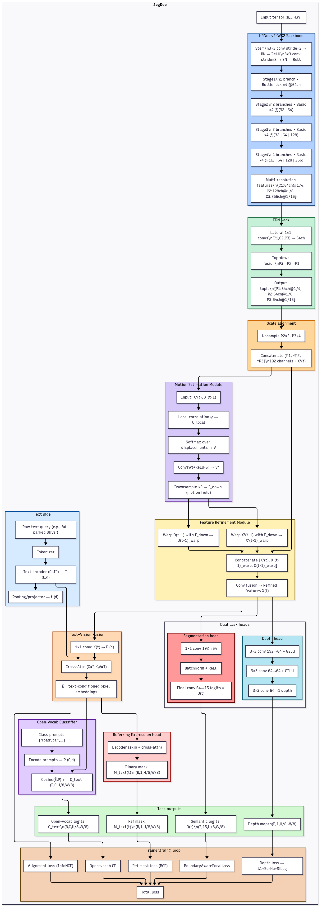

# SegDep: Joint Segmentation and Depth with Text Queries on Virtual KITTI 2

> 🚦 A multi-task architecture that combines **semantic segmentation**, **depth estimation**, and **text-driven query segmentation** for autonomous driving research.

---

## 🔎 Motivation

Understanding road scenes requires more than just segmentation. Modern autonomous systems need:
- **Semantic segmentation** to identify objects like cars, pedestrians, and roads.
- **Depth estimation** to reason about 3D geometry.
- **Open-vocabulary reasoning** to adapt to unseen classes and natural-language queries.

While most models handle these tasks separately, I present **SegDep**, a unified architecture that integrates all three.

---

## 🏗️ Architecture Overview

SegDep builds upon **HRNetv2-W32** with several extensions:

- **HRNetv2 Backbone (Cityscapes pretrained):** Strong spatial features.
- **FPN + Scale Alignment:** Normalizes multi-scale features to a unified tensor.
- **Motion Estimation + Refinement:** Warps features/logits across frames for temporal stability.
- **Text Encoder (CLIP):** Encodes class names or free-form queries.
- **Text–Vision Fusion:** Cross-attention fuses query embeddings with pixel features.
- **Heads:**
  - **Segmentation head:** Closed-set semantic predictions.
  - **Depth head:** Dense depth regression.
  - **Open-vocab head:** Class prompt logits (zero-shot).
  - **Referring head:** Binary masks for natural-language queries.

---

## 🔹 Architecture Diagram

  

## 🔧 Training Setup

- **Dataset:** [Virtual KITTI 2 (VKITTI2)](https://europe.naverlabs.com/research/computer-vision/proxy-virtual-worlds-vkitti-2/)  
  ~21k frames with pixel-wise labels, dense depth, and varied weather/lighting.
- **Initialization:** HRNetv2-W32 pretrained on Cityscapes.
- **Optimizer:** AdamW  
  - LR = 1e-4 for backbone, 1e-3 for new heads  
  - Batch size = 8  
  - Epochs = 40
- **Loss Functions:**
  - Segmentation: BoundaryAwareFocalLoss
  - Depth: L1 + BerHu + Scale-Invariant Log (SiLog)
  - Open-vocab: CE + distillation from SEG head
  - Referring: BCE 
  - Alignment: InfoNCE for text–vision space

---

## 📊Results on VKITTI2

| Task                     | Metric(s)                   | Performance |
|--------------------------|------------------------------|-------------|
| Segmentation (closed set) | mIoU                        | **81%**     |
| Depth estimation         | AbsRel / δ1                 | **0.08 / 0.91** |
| Open-vocab segmentation  | mIoU (seen / synonyms)      | **81% / 70%** |

## 🌍 Why Cityscapes Pretraining Matters

Using HRNet pretrained on **Cityscapes** provides:
- **+3–5% mIoU** improvement over scratch.
- **Better depth geometry:** AbsRel 0.09 → 0.08.
- **Improved text alignment:** Stronger zero-shot performance on synonyms and novel class names.

---

## 💡 Key Takeaways

- **Unified multi-task model:** Segmentation + depth + text queries in one pipeline.
- **Temporal refinement:** Improves stability across video frames.
- **Open-vocab segmentation:** Works with unseen classes by providing text prompts.
- **Referring expressions:** Currently limited — requires datasets like RefCOCO/PhraseCut for stronger supervision.

---

## 📌 Future Work

- Add **phrase-level datasets** (RefCOCO, PhraseCut) for better referring segmentation.  
- Extend evaluation to **real-world KITTI/Cityscapes** for domain adaptation.  
- Explore **LLM-guided prompts** for richer interactive queries.  

## 🚀 Conclusion

SegDep pushes multi-task learning beyond traditional perception by combining **geometry, semantics, and language grounding**.  
By training on VKITTI2, the model achieves strong segmentation and depth results, while opening the door to **interactive, text-driven perception**.  

✨ **Stay tuned — code will be released soon!** ✨
